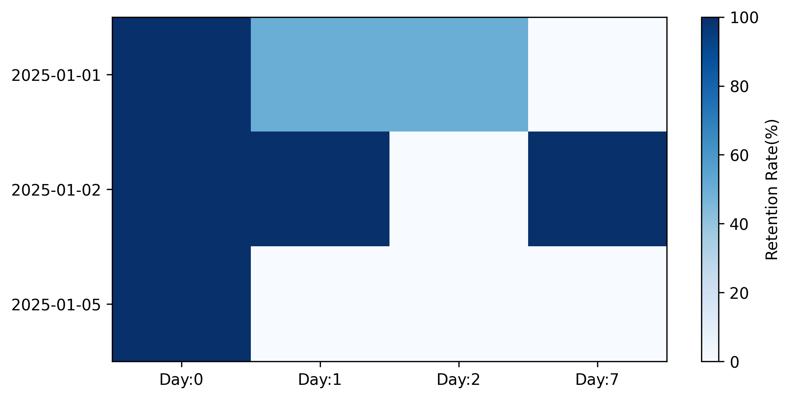

# User Retention Analysis (用户留存分析)

## Retention Heatmap



---

## 项目简介

用户留存率是衡量产品用户质量和用户黏性的核心指标之一。
本项目基于 Cohort Analysis(同期群分析)方法，
对用户在首次活跃后的第 N 天留存情况进行分析，
并通过构建留存矩阵和热力图，直观展示不同用户群体的留存表现。

---

## 项目目标

- 计算用户第 N 天的留存率；

- 构建留存率矩阵 (Retention Matrix);

- 利用热力图展示用户留存变化趋势；

- 根据留存结果分析用户行为特征，并提出业务优化建议。

---

## 数据说明

示例数据包含用户 ID 及对应的活跃日期：

| user_id | activity_date |
|----------|---------------|
| 1 | 2025-01-01 |
| 1 | 2025-01-02 |
| 2 | 2025-01-01 |
| ... | ... |

其中：

- `user_id`：用户唯一标识；
- `activity_date`：用户活跃日期。

每条记录表示某位用户在某一天发生过活跃行为。

---

## 分析流程

### 1. 准备数据

首先计算每位用户的首次活跃日期（ Cohort ）:
```text
first_day = 用户首次活跃日期
随后将首次活跃日期合并回原始数据，
并计算用户的留存天数：
retention_day = activity_date - first_day
最终得到包含以下字段的数据表：
user_id
activity_date
first_day
retention_day

### 2. 计算任意 N 日的留存率

留存率计算公式如下：
留存率 = 第 N 天仍活跃的用户数 / 新增用户数 * 100%
具体步骤包括：

- 统计新增人口数

- 统计第 N 天仍然活跃的用户数

- 根据公式计算留存率

- 并将其封装成函数进行复用

### 3. 计算留存率矩阵

首先统计不同 Cohort 在各留存天数上的活跃用户数：

随后利用 unstack() 将结果展开为矩阵形式：


最后，以每个 Cohort 的新增用户数（Day0）作为基准，计算对应留存率：

### 4. 可视化

将计算得到的留存率矩阵导出为 CSV 文件，并利用 Matplotlib 绘制留存热力图，以更加直观地展示不同用户群体的留存变化趋势。

---

## 核心结果

- Cohort: 2025-01-01 

Day1 留存率为 50%；
Day2 留存率为 50%；
Day7 留存率下降至 0%。

说明该批用户短期内存在一定活跃度，但缺乏长期留存。

- Cohort: 2025-01-02

Day1 留存率达到 100%；
Day7 留存率仍保持 100%。

说明该批用户活跃度和用户黏性较高，留存表现较好。

- Cohort: 2025-01-05 

Day0 后留存率迅速下降至 0%。

说明该批用户存在明显流失现象，需要进一步分析用户来源、产品体验或运营活动等因素。

## 业务启示

对于高留存用户群体，可进一步挖掘其行为特征，形成优质用户画像；
对于低留存 Cohort，应重点分析用户获取渠道、首日体验及运营策略；
可结合漏斗分析、用户分层（RFM）等方法，进一步定位用户流失原因。

---

## 技术栈

- Panth
- Pandas
- Matplotlib
